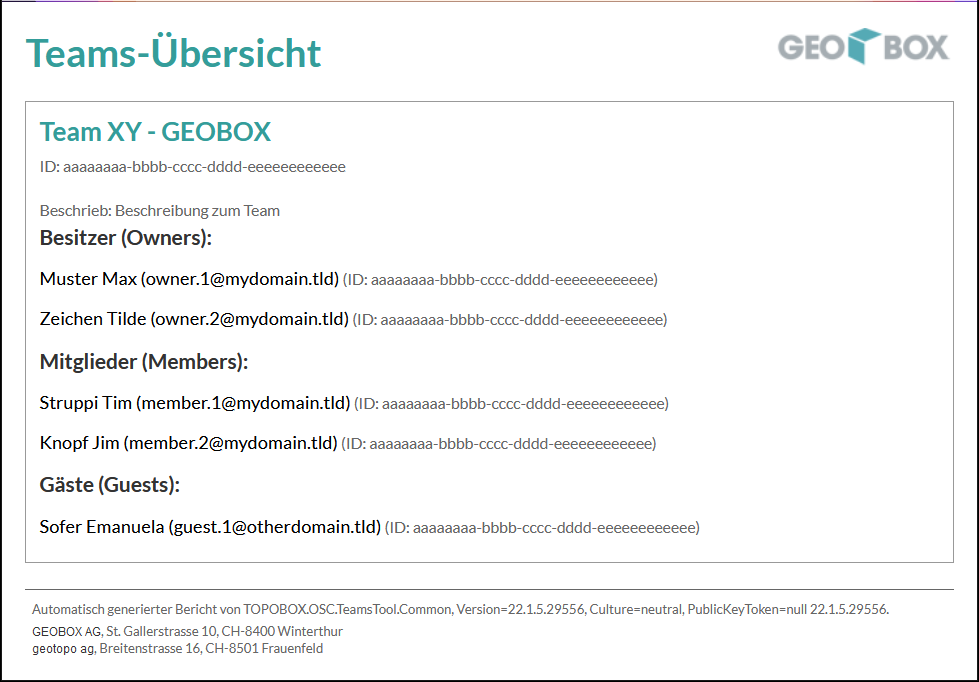

# **TOPOBOX - Tool Set für Microsoft Teams**
Dieses Projekt umfasst einige Tools als Erleichterung für das Microsoft Teams.
Die Tools und Anforderungen sind auf die Bedürfnisse der Unternehmen geotopo AG und GEOBOX AG zugeschnitten.

# Tools

## Konsole App - ConsoleApp
___
### Kurzbeschrieb

Die Konsole verfügt über Funktionen für die lokale Speicherung von Gruppen-, Team- und Benutzerinformationen.

### Beispielaufruf

Teamübersicht mit zugehörigen Besitzern, Mitgliedern und Gästen als HTML exportieren

```
TOPOBOX.TeamsTool.Console.exe --functiontype=exportTeamsOverviewHTML --folderpath="C:\Temp" --filename="ExportTeamOverview" --logfilepath="C:\Temp\LogFile_ExportTeamOverview"
```
### HTML-Ausgabe


- ToDo: Link zum Wiki für die Beschreibung

## Konsole App - PresenceApp
___
### Kurzbeschrieb

ToDo: Beschreibung

### Beispielaufruf

```
ToDo: Aufruf
```
- ToDo: Link zum Wiki für die Beschreibung

## Desktop Applikation - Teams Tool
___
- ToDo kurze Beschreibung
- Link zum Wiki für die Beschreibung


## Third Party Licenses - Runtime

Das Tool verwendet diverse Komponenten aus verschiedenen Quellen mit verschiedenen Lizenzen die zu Beachten sind.

|                              |            |            |
|------------------------------|------------|------------|
| CommandLineParser            | [Link zum Projekt](https://github.com/commandlineparser/commandline) | [Lizenz](https://www.nuget.org/packages/CommandLineParser/2.8.0/license)  |
| Microsoft.Graph              | [Link zum Projekt](https://developer.microsoft.com/en-us/graph) | [Lizenz](https://www.nuget.org/packages/Microsoft.Graph/4.0.0-preview.7/license)  |
| Microsoft.Graph.Auth         | [Link zum Projekt](https://developer.microsoft.com/en-us/graph) | [Lizenz](https://www.nuget.org/packages/Microsoft.Graph.Auth/1.0.0-preview.7/license)  |
| Microsoft.Identity.Client    | [Link zum Projekt](https://github.com/AzureAD/microsoft-authentication-library-for-dotnet) | [Lizenz](https://licenses.nuget.org/MIT)  |
| Newtonsoft.Json              | [Link zum Projekt](https://www.newtonsoft.com/json) | [Lizenz](https://licenses.nuget.org/MIT)  |


## Beiträge zur Weiterentwicklung

Diese Projekt ist als OpenSource-Projekt gestaltet. Feedback zum Quellcode nehmen wir gerne entgegen. Bugs oder Probleme sollten als GitHub issues gemeldet werden.

## Lizenz

Diese Projekt ist Lizenziert unter der [MIT License](LICENSE).

## Mitwirkende

|                          |                                  |
|--------------------------|----------------------------------|
|     | [geotopo ag](https://www.geotopo.ch) <br> Breitenstrasse 16 <br> CH-8501 Frauenfeld <br> Tel +41 52 724 03 50 <br> Fax +41 52 724 03 51 <br> info@geotopo.ch       |                                       
|     |[GEOBOX AG](https://www.geobox.ch) <br> St. Gallerstrasse 10 <br> CH-8400 Winterthur <br> +41 44 515 02 80 <br> info@geobox.ch     |


